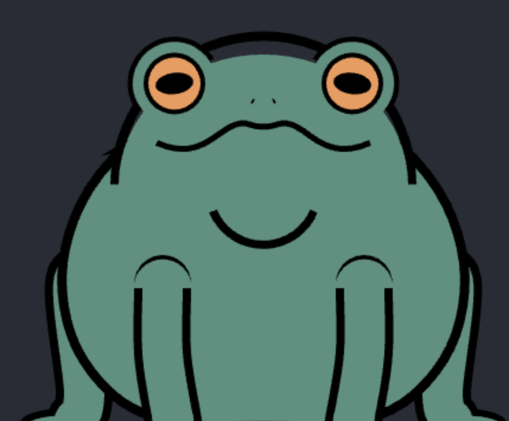

# Soft Body Frog Simulation 🐸

A physics-based interactive frog with procedural animation, sound effects, and special Wednesday surprises!



## [Live Demo: Is It Wednesday My Dudes?](https://it-is-wednesday.vercel.app/)

## Origin Story

After watching the excellent tutorial by [@argonautcode](https://www.youtube.com/@argonautcode) on [soft-body procedural animation](https://www.youtube.com/watch?v=GXh0Vxg7AnQ), I decided to recreate the project using plain JavaScript! The original Processing code can be found [here](https://github.com/argonautcode/soft-body-proc-anim).

It is well known at work that I love frogs, and everyone who knows me personally can confirm this as a fact. This project is the natural evolution of that passion. 🐸💚

## Features

- **Realistic Soft-Body Physics**: The frog's body reacts realistically to interactions and gravity
- **Interactive Behaviors**:
  - Click/drag to interact with the frog
  - Random blinking and croaking animations
  - Special sounds when agitated or thrown
- **Device Motion Controls**: Tilt your device (mobile only) to make the frog respond to gravity
- **Wednesday Mode**: Special surprises activate on Wednesdays (or test it yourself with the override if you clone the repo)
- **Responsive Animation**: Works on both desktop and mobile devices

## How It Works

The animation uses advanced soft-body physics techniques:

- **Verlet Integration**: For realistic and stable physics simulation
- **Spring Physics**: The frog's body parts are connected with simulated springs
- **Constraint Solving**: Maintains the shape and volume of the frog
- **Procedural Animation**: Blinking, croaking, and other animations are procedurally generated

## Controls

### Desktop
- **Click and drag**: Interact with the frog's body
- **Fast mouse movement**: May cause the frog to scream

### Mobile
- **Tap and drag**: Interact with the frog
- **Throw gesture**: Quick releasing after dragging may surprise the frog
- **Device tilting**: Activate motion controls to use your device's gravity sensors

## Technical Details

This project is built with pure JavaScript and HTML5 Canvas. It implements:

- Physics-based animation using Verlet integration
- Custom constraint solving for soft body simulation
- Audio synchronization for animations
- Device orientation and motion detection
- Procedural animation for eyes, mouth, and legs

## Development

Clone the repository and open `index.html` in your browser to run the simulation locally:

```bash
git clone https://github.com/davidroman0O/frog-procedural-soft-body.git
cd frog-procedural-soft-body
# Open index.html in your browser
```

## Special Easter Eggs

- Try visiting on a Wednesday
- Throw or shake the frog aggressively
- Play with motion controls on mobile

## License

[MIT License](LICENSE)

## Acknowledgments

- [@argonautcode](https://www.youtube.com/@argonautcode) for the original concept and tutorial
- The "It is Wednesday my dudes" meme community
- All frog enthusiasts worldwide 🐸
